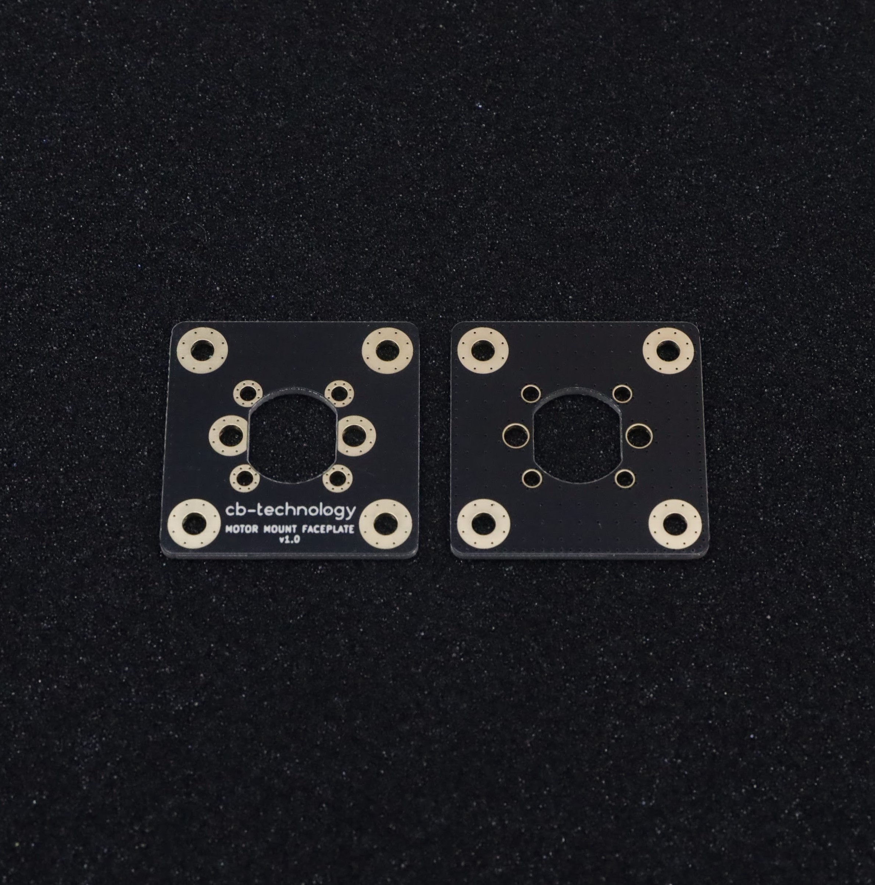
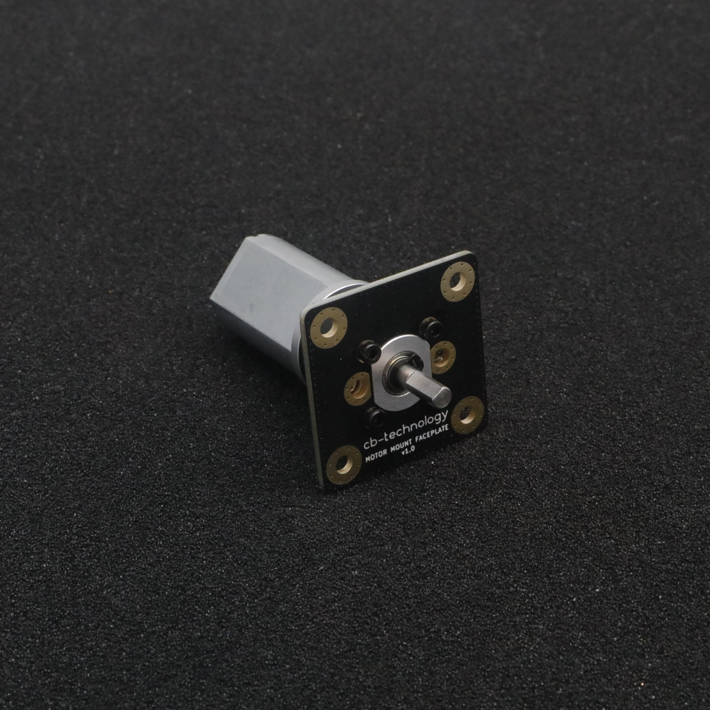
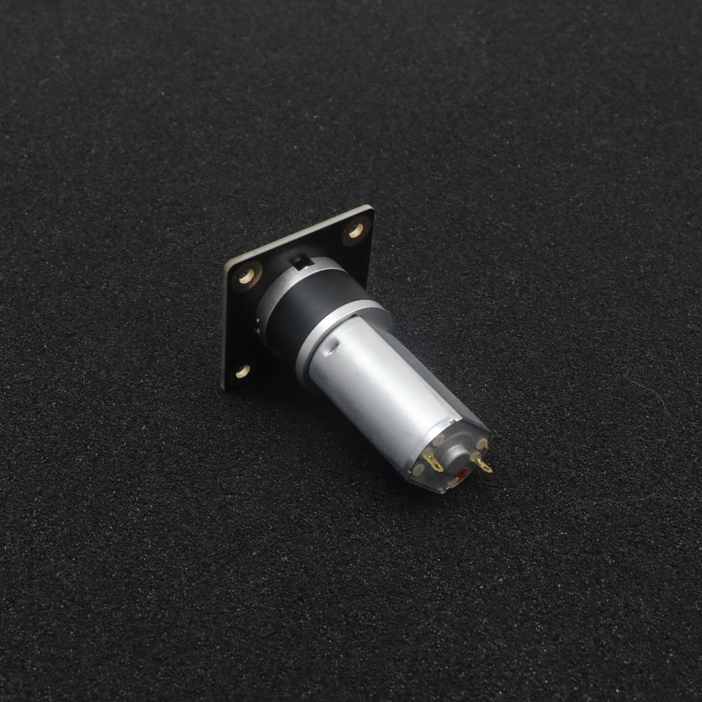
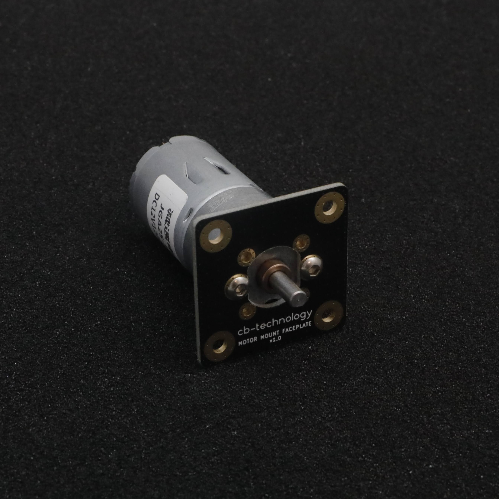
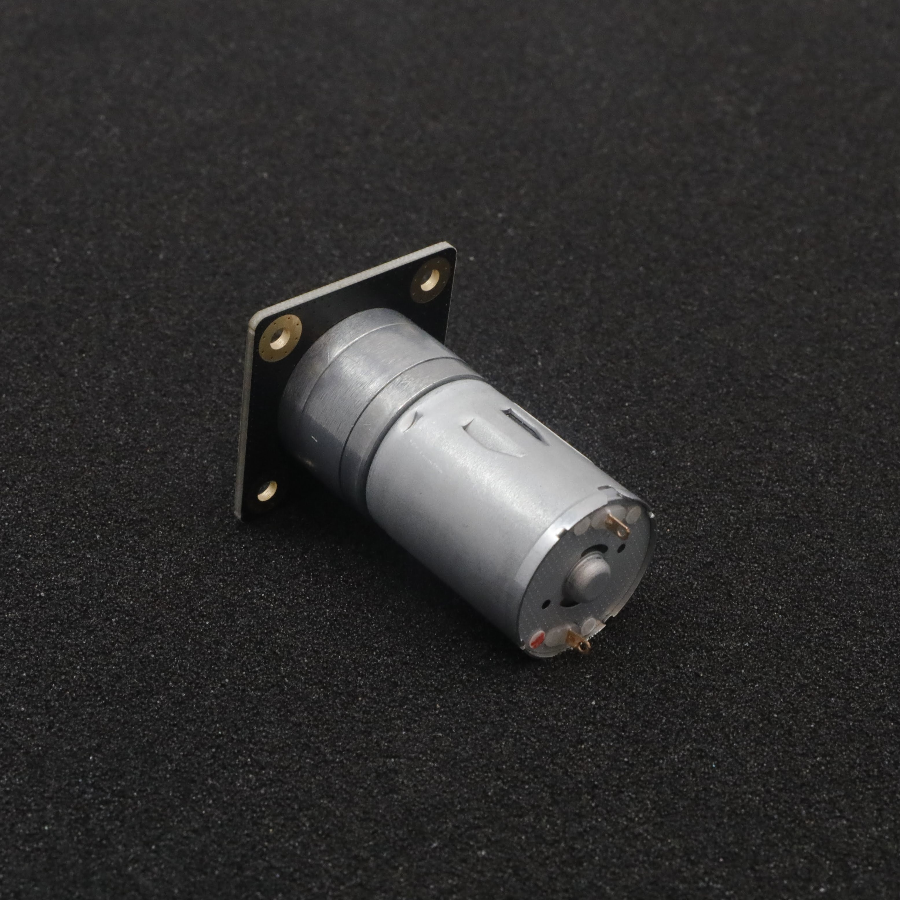
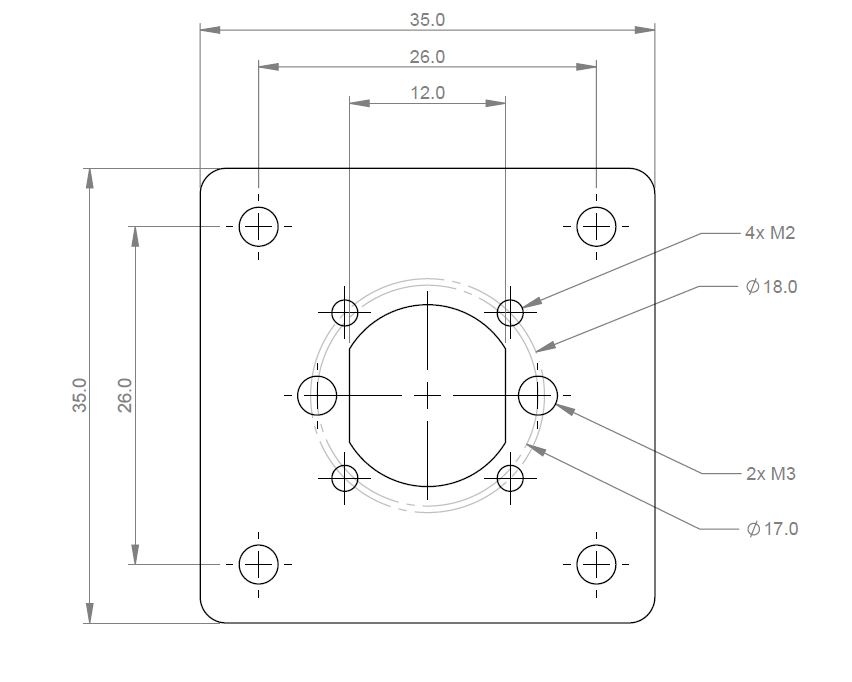

# 22/25mm MOTOR FACEPLATE MOUNT v1.0 (2-pack)

 

Each FACEPLATE is designed to easily and rigidly panel mount a single 22 or 25mm motor to your desired chassis. This product was orignially designed for combat robotics but is suitable as a mount for any application using these motors. 

Developed, assembled, and tested in [Christchurch, New Zealand](https://www.google.co.nz/maps/place/Christchurch+New+Zealand), by Connor Benton.

#### 22mm MOTOR

 

#### 25mm MOTOR

 

## FEATURES
- Easy and rigid way to panel mount standard 22 and 25mm motors.
- Faceplace is constructed from fiberglass so is very rigid while minimising weight. 

## SPECIFICATIONS
- **Dimensions:** 35x35x1.6 mm
- **Weight:** 3.5g each
- **Material:** FR4 (Fiberglass)

## PACKAGE INCLUDES

- 2x 22/25mm MOTOR FACEPLATE MOUNT
- 4x M2x4 for Mounting 22mm Motor
- 2x M3x6 for Mounting 25mm Motor

## FACEPLATE INSTALL PATTERN

